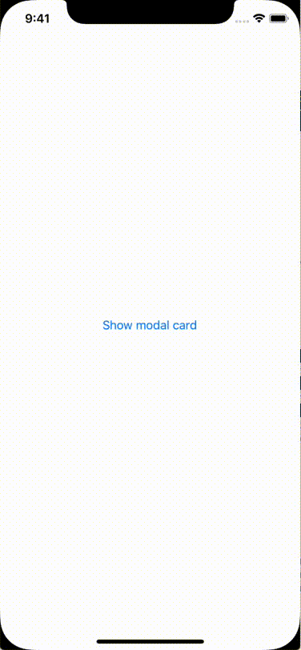

# ModalCard

Easily enables you to modally present a view controller as a card that does not extend the default height.



It's a simple as adding the following code to the modal view controller:

```swift
class ModalViewController: UIViewController {

    private var modalCardController: ModalCardController!

    override func awakeFromNib() {
        super.awakeFromNib()
        modalCardController = ModalCardController(parent: self, modalHeight: 200)
    }
}
```

## Installation Instructions

Add to your `Podfile`:

```
pod 'RIModalCard', :git => 'https://github.com/RocketLaunchpad/RIModalCard.git', :branch => 'master'
```

